# 📊 OmniTrack | Enterprise Marketing Analytics & Multi-Touch Attribution Engine

[](https://opensource.org/licenses/MIT)
[](https://www.python.org/downloads/)
[](https://cloud.google.com/bigquery)
[](./index.html)

> An end-to-end data science and analytics platform designed to solve the digital marketing measurement crisis: cross-channel attribution distortion, walled-garden double-counting, privacy signal loss, and unmonitored capital misallocation.

---

## 🌟 Key Capabilities

1. **Multi-Touch Attribution (MTA) Engine:**
   - Evaluates conversion and revenue distribution across **First-Touch (FTA)**, **Last-Touch (LTA)**, **Linear (MTA)**, and **Position-Based (40-20-40)** models.
   - Eliminates last-click bias that structurally penalizes top-of-funnel discovery channels (Display & Social) while artificially inflating lower-funnel channels (Paid Search & Email).

2. **Automated Anomaly & Spend Bleed Alerting:**
   - Real-time rule-based & statistical Z-score anomaly detection engine.
   - Detects sub-target ROAS (< 2.2x), high CAC, and negative ROI campaigns with automated severity classification (**SEV-1 Critical**, **SEV-2 Warning**, **Opportunity**).

3. **Interactive Executive Web Dashboard:**
   - **Executive Overview:** Real-time KPI scorecards, cumulative media spend vs. revenue pacing curve, and channel portfolio allocation.
   - **Campaign Matrix & Alerts:** 4-quadrant efficiency matrix (Spend vs. ROAS) and incident-style triage feed.
   - **Attribution & Journey Waterfall:** Cross-model lift analysis and common customer journey pathways.
   - **What-If Budget Reallocation Simulator:** Live sliders to model cutting the \$144.3k competitor search bleed and reallocating funds into high-performing channels.
   - **Dual Themes:** Executive Dark Mode & Boardroom Light Mode toggle.

4. **Production Data Warehouse SQL Pipeline:**
   - Fully optimized ANSI SQL queries utilizing analytical window functions (`COUNT() OVER()`, `ROW_NUMBER()`, `SAFE_DIVIDE`) compatible with **Google BigQuery**, **Snowflake**, and **Databricks**.

---

## 🏗️ Architecture & Data Flow

```mermaid
flowchart LR
    subgraph Ingestion["1. Multi-Channel Touchpoints"]
        A1["Paid Search"]
        A2["Paid Social"]
        A3["Display Programmatic"]
        A4["Email & Retention"]
        A5["Organic Search"]
    end

    subgraph Engine["2. Attribution & Analytics Engine"]
        B1["Customer Journey Sequences"]
        B2["MTA Weight Calculations<br/>(First, Last, Linear, U-Shaped)"]
        B3["Anomaly & Z-Score Detection"]
    end

    subgraph DataOutputs["3. Analytical Datasets"]
        C1["campaign_summary.csv"]
        C2["mta_attribution_summary.csv"]
        C3["campaign_alerts.csv"]
        C4["customer_journeys.csv"]
    end

    subgraph Presentation["4. Executive Web Application"]
        D1["OmniTrack Portal (index.html)"]
        D2["Power BI / Tableau Integration"]
    end

    Ingestion --> Engine
    Engine --> DataOutputs
    DataOutputs --> Presentation
```



---

## 📈 Empirical Analysis & Key Findings

| Marketing Channel | Total Spend | Last-Touch Rev | Linear MTA Rev | **Attribution Variance** | Strategic Diagnostic |
| :--- | :--- | :--- | :--- | :--- | :--- |
| **Display Programmatic** | \$36,875.66 | \$3,665.96 | **\$6,707.47** | **+83.0% Lift** 🚀 | Originated 87 first-touch journeys vs. 39 last clicks. Last-click misses 45% of Display's true pipeline value. |
| **Social Media (Meta)** | \$72,566.04 | \$7,647.80 | **\$8,622.19** | **+12.7% Lift** 📈 | Prime upper-funnel discovery engine (99 first-touch conversions) driving mid-funnel consideration. |
| **Organic Search** | \$0.00 | \$4,200.90 | **\$5,236.19** | **+24.6% Lift** | High-intent organic baseline that paid search brand bidding frequently cannibalizes. |
| **Paid Search (Google)** | \$180,873.09 | \$12,958.62 | **\$9,907.80** | **-23.5% Over-credit** 📉 | Over-indexed on last-touch (106 last vs 75 first). Captures demand initiated by Display and Social. |
| **Email & Retention** | \$2,691.58 | \$6,861.82 | **\$4,861.45** | **-29.2% Closer** | The consummate transaction closer (64 last-touch vs 16 first-touch). Delivers **62.95x ROAS**. |

---

## 📁 Repository Structure

```
├── index.html                   # Interactive Executive Web Application & Dashboard
├── attribution_engine.py         # Python Analytics, MTA, and Anomaly Alert Engine
├── multi_touch_attribution.sql  # Production BigQuery/Snowflake SQL Engine
├── campaign_summary.csv         # Aggregated campaign metrics & costs
├── mta_attribution_summary.csv  # Cross-model attribution comparison dataset
├── campaign_alerts.csv          # Flagged campaign anomalies & prescriptive actions
├── customer_journeys.csv        # Simulated multi-touch customer touchpoint sequences
├── requirements.txt             # Python dependencies (pandas, numpy)
├── .gitignore                   # Standard ignore rules
└── README.md                    # Comprehensive documentation
```

---

## 🚀 Quickstart Guide

### 1. Run the Python Analytics Engine
```bash
# Clone the repository
git clone https://github.com/<your-username>/marketing-analytics-attribution.git
cd marketing-analytics-attribution

# Setup virtual environment
python -m venv .venv
source .venv/bin/activate  # On Windows: .venv\Scripts\activate

# Install dependencies
pip install -r requirements.txt

# Run engine
python attribution_engine.py
```

### 2. Launch the Interactive Web Dashboard
Simply open `index.html` in any modern web browser, or serve it locally:
```bash
python -m http.server 8085
# Visit http://localhost:8085
```

---

## 🌐 Deploy to GitHub Pages

1. Push this repository to GitHub.
2. Go to **Settings** &rarr; **Pages**.
3. Under **Build and deployment**, select **Deploy from a branch**.
4. Set branch to `main` and folder to `/(root)`.
5. Click **Save**. Your dashboard will be live at `https://<your-username>.github.io/<repo-name>/`.

---

## 📄 License
This project is licensed under the MIT License - see the LICENSE file for details.
